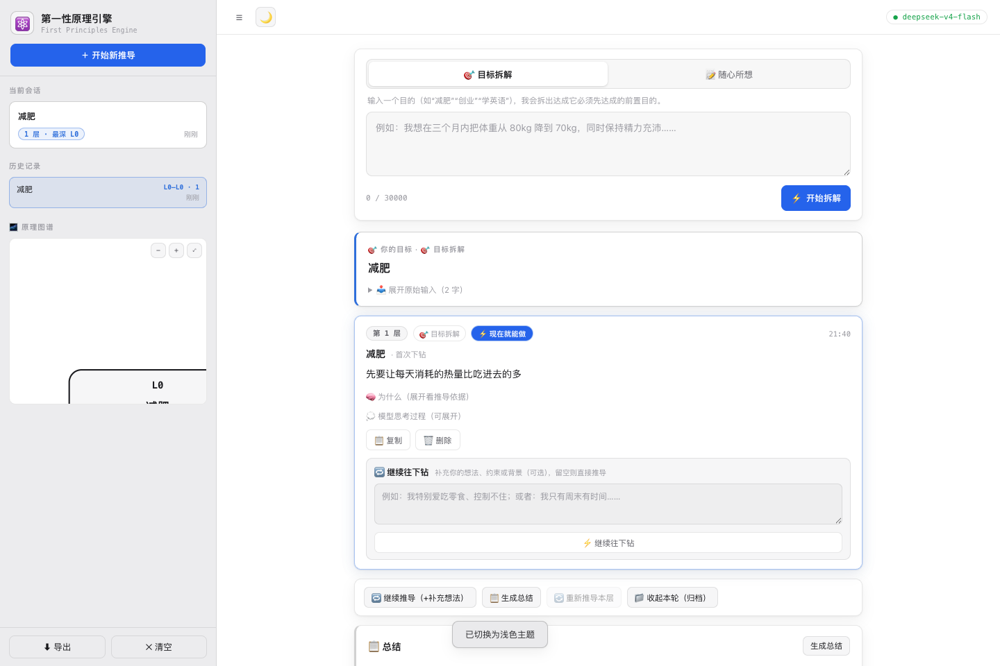
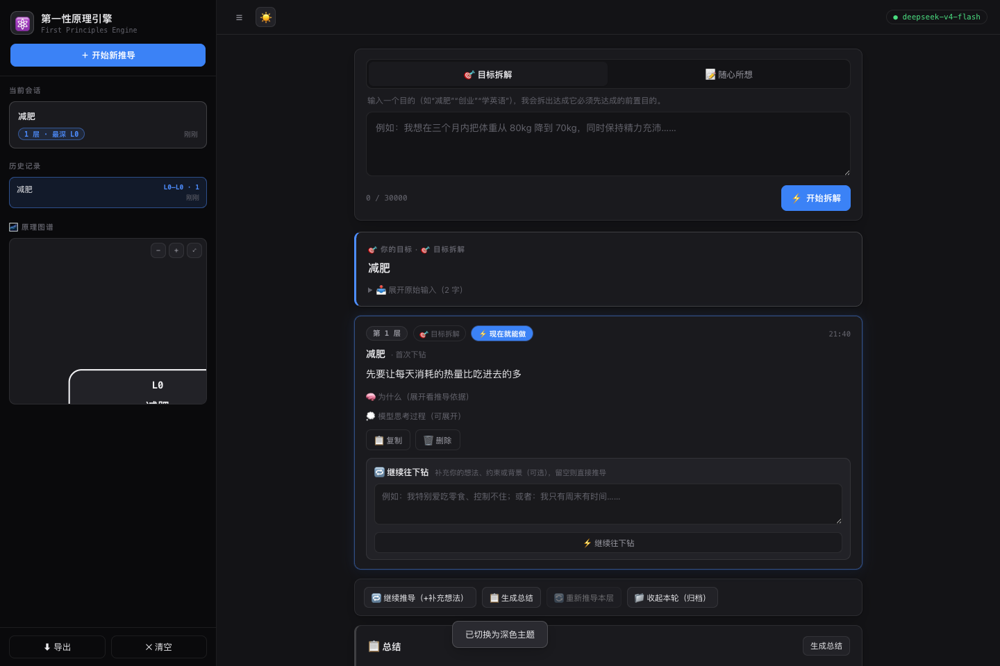

<div align="center">

# ⚛️ 第一性原理引擎 · First Principles Engine

**把目标一路「下钻」到马上能做的事**

输入一个目标（或一段散乱的长文本）→ 提炼核心目标 → 逐层推导**前置目的**：
要做到 A，必须先做到 B；要做到 B，必须先做到 C —— 直到落到「现在就能做」的事。
全程大白话，不钻抽象理论。

[功能特性](#-功能特性) · [快速开始](#-快速开始) · [使用流程](#-使用流程) · [API](#-api) · [项目结构](#-项目结构) · [路线图](#-路线图)

</div>

---

## ✨ 功能特性

### 核心概念：目的前置链

- 每一层是**「可执行的、更前置的目的」**——不是并列的执行步骤，不是抽象哲学原理
- 方向：具体目标 → 越来越根本的前置条件 → **「现在就能做」的事**
- 语言风格：大白话、一句话、可执行（模型硬约束，禁止专业术语/公式/掉书袋）

### 界面与交互

| 能力 | 说明 |
| --- | --- |
| 🎯 **输入与提取** | 两种模式：目标拆解（输入目的） / 随心所想（粘贴散乱长文本，先提炼核心意图再下钻） |
| 🔁 **逐层下钻** | 每个节点可继续推导，推导结合**【整条目的链 + 全部历史补充 + 本次补充想法】**；硬约束：更前置、不重复、不绕圈 |
| 💬 **补充输入框常驻** | 每个节点下方常驻输入框：填写你的约束/背景/偏好，模型结合它生成更贴合的一层；留空直接推导 |
| 🛡 **防重复点击** | 推导进行中按钮自动禁用 + 逻辑层双重防护，避免重复生成节点 |
| ✅ **可执行标记** | `isActionable` 节点显示蓝色高亮边框 +「⚡ 现在就能做」徽章 |
| 🗂 **会话管理** | 左侧工作空间：「当前会话」卡片 + 「历史记录」列表（点击切换、hover 删除）；「收起本轮」折叠当前链 |
| 📋 **总结（markdown）** | 整链大白话总结：总体概括 + 共同主题 + 行动建议，markdown 渲染 |
| 🔄 **重新推导本层** | 对链的最后一层用相同参数（含原补充）重新生成 |
| 🌌 **原理图谱** | 树形可视化，灰阶层级、跟随主题、可缩放平移，点击节点定位卡片 |
| 🌗 **双主题** | 深色/浅色（黑白灰 + 蓝色强调），跟随系统偏好、可手动切换、持久化 |
| 💾 **持久化** | 会话数据存 localStorage，刷新不丢；支持导出 Markdown |

### 界面预览

| 深色主题 | 浅色主题 |
| :---: | :---: |
|  |  |

## 🚀 快速开始

要求：**Node.js ≥ 18**（自带 `fetch`），零第三方依赖，无需 `npm install`。

```bash
# 1. 配置 API Key（两种方式任选，环境变量优先）
#    方式 A：环境变量
export DEEPSEEK_API_KEY=sk-xxxxxxxx
export DEEPSEEK_MODEL=deepseek-v4-flash

#    方式 B：编辑 config.json（已被 .gitignore 忽略，不会提交）
#    { "apiKey": "sk-xxxxxxxx", "model": "deepseek-v4-flash" }

# 2. 启动
node server.js

# 3. 打开浏览器
open http://127.0.0.1:3000
```

## 🧭 使用流程

```
初始态：主区输入「一个目标，或随便说说你的想法」
  ↓
输入目标/长文本 → 提炼核心意图 + 第 1 层前置目的
  主区变成：目标卡片 + 节点链
  ↓
点「继续往下钻」，可选填写「补充想法」
  → 下一层 = 模型结合【整条链 + 全部历史补充 + 本次补充】推导
  ↓
…循环，直到不再继续
  ↓
点「生成总结」→ 整链大白话总结（含马上能做的第一件事）
  ↓
点「收起本轮」→ 折叠当前链；左侧历史记录可随时切回
```

## ⚙️ 配置

`config.json`（可留空，全部走环境变量）：

```json
{
  "apiKey": "sk-xxxxxxxx",
  "model": "deepseek-v4-flash",
  "baseUrl": "https://api.deepseek.com",
  "port": 3000
}
```

| 环境变量 | 默认值 | 说明 |
| --- | --- | --- |
| `DEEPSEEK_API_KEY` | 必填 | API 密钥（仅存在于服务端） |
| `DEEPSEEK_MODEL` | `deepseek-v4-flash` | 模型名 |
| `DEEPSEEK_BASE_URL` | `https://api.deepseek.com` | 接口地址（OpenAI 兼容） |
| `PORT` | `3000` | 服务端口 |

## 📡 API

### `POST /api/derive` — 目的下钻

请求：

```json
{
  "text": "三个月减重10公斤",
  "mode": "goal",
  "hint": "我特别爱吃零食，控制不住",
  "context": { "depth": 0, "ancestors": [{ "label": "...", "principle": "...", "depth": 0 }] }
}
```

- `mode`：`goal`（目标拆解） / `text`（随心所想，返回 essence） / `derive`（继续下钻）
- `hint`：用户补充想法（推导时结合）
- `context`：已走过的目的链（继续下钻时携带，避免重复绕圈）
- 响应：`{ data: { label, principle, essence?, reasoning, keywords, isActionable }, thinking }`
- 容错：`response_format: json_object` + 提取首个 JSON 对象兜底 + 解析失败自动重试一次（放宽 token）

### `POST /api/summarize` — 整链总结

```json
{ "nodes": [{ "label": "...", "principle": "...", "essence": "...", "depth": 0 }] }
```

→ `{ "data": { "summary": "markdown 总结", "themes": [], "actions": [] } }`

### `GET /api/health` — 健康检查

→ `{ "ok": true, "model": "deepseek-v4-flash", "apiKeySet": true }`

## 🏗 项目结构

```
server.js            # 零依赖 Node 后端：静态服务 + DeepSeek 代理（含自动重试）
config.json          # API 配置（已 gitignore，不入库）
public/
  index.html         # 页面结构（左侧工作空间 + 右侧主推导区）
  style.css          # 双主题（深/浅）Codex 式样式
  app.js             # 前端逻辑（会话管理 / 渲染 / 导出 / 持久化 / 主题）
  tree.js            # SVG 图谱（灰阶调色板跟随主题，自动布局 + 缩放平移）
  md.js              # 轻量 Markdown 渲染器
docs/screenshots/    # 界面截图
```

## 🛠 技术栈

- **后端**：Node.js 原生 `http`（零依赖）
- **前端**：原生 HTML/CSS/JS（无框架、无构建步骤）
- **模型**：DeepSeek（OpenAI 兼容接口），支持任意兼容模型切换
- **存储**：浏览器 localStorage（无需数据库）

## 🗺 路线图

- [ ] 流式推导（思考流实时显示）
- [ ] 推导流断点续传 / 中途取消
- [ ] 会话重命名与标签
- [ ] 并行对比推导（同一节点多角度下钻）
- [ ] 一键部署脚本（Docker / 云函数）

## 📄 License

[MIT](LICENSE)
